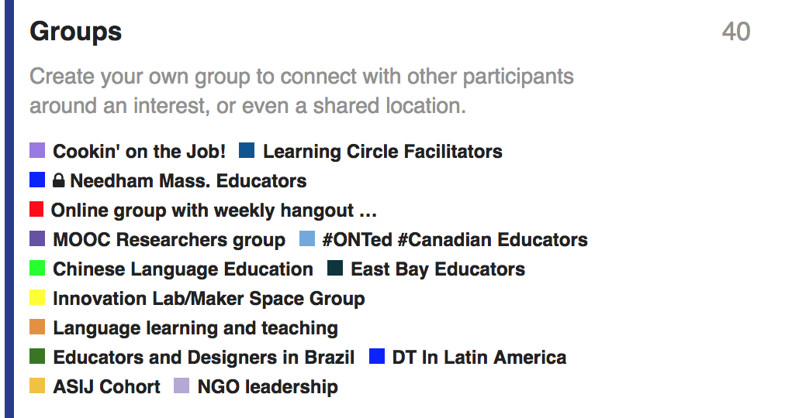
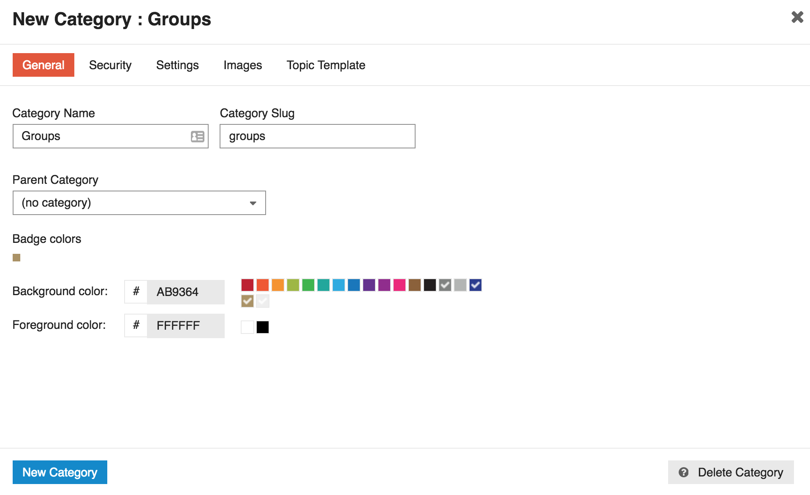

# discourse-tsl-mods
Discourse plugin with mods for TSL's EdX courses

## Learner user experience
#### 1. Learner sees a Groups category


#### 2. Learner sees Groups that other learners have created


#### 3. Learner can create their own Group


## Course author user experience
#### 1. Author sets the name of the special "Groups" category


#### 2. Author creates a new category with that name



#### 3. Learners can now create their own groups


## Local development
You can develop with Vagrant ([see Discourse docs](https://github.com/discourse/discourse/blob/master/docs/VAGRANT.md)).  As you develop, clear the ERB cache, copy this repository to the `plugins` folder and restart Rails to see changes.

On OSX you may also need to enable NFS for volume sharing, by adding an option to the Discourse Vagrantfile:

```
config.vm.synced_folder ".", "/vagrant", id: "vagrant-root", nfs: true
```

Example (also using `discourse-edx-lti`):
```
rm -rf tmp/cache && \
rm -rf plugins && \
git checkout head -- plugins && \
rsync -av --exclude .git \
  ~/github/mit-teaching-systems-lab/discourse-edx-lti \
  ./plugins/ && \
rsync -av --exclude .git \
  ~/github/mit-teaching-systems-lab/discourse-tsl-mods \
  ./plugins/ && \
vagrant ssh -c 'cd /vagrant && bundle exec rails s -b 0.0.0.0'
```
